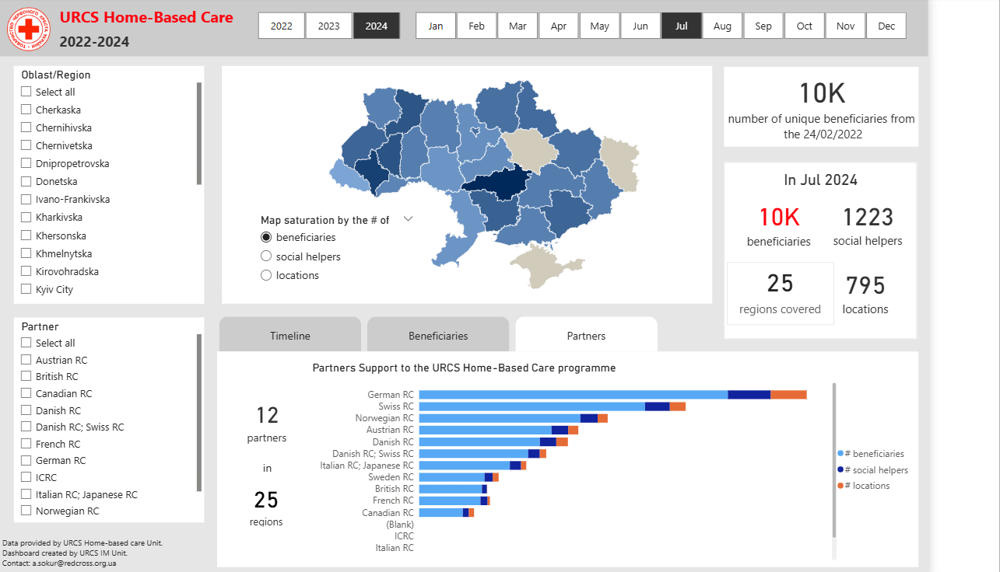
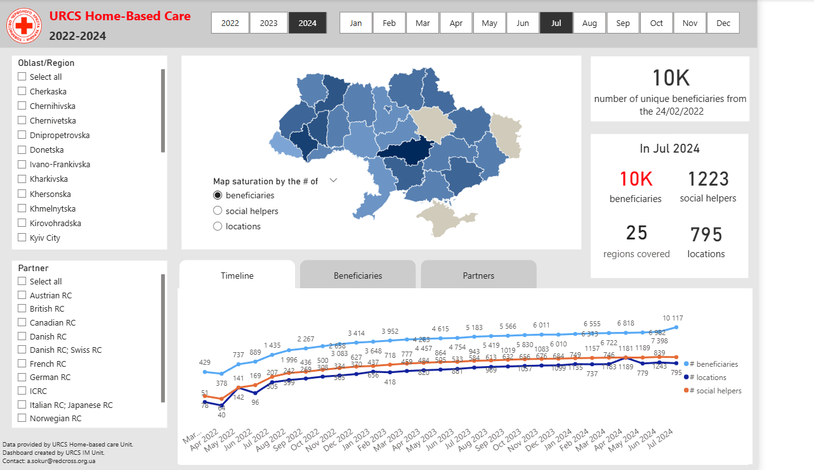
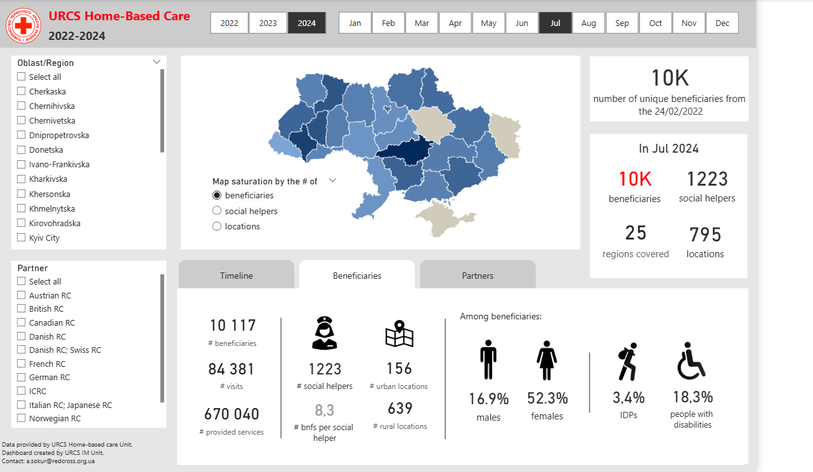

# Home-Based Care Dashboard

## Overview

This Power BI dashboard was created for the Home-Based Care programme across Ukraine.

The dashboard shows people who need home-based care, including new and unique beneficiaries by year and month. It also tracks the number of visits, provided services, social helpers, locations, and donor or partner support.

I created this dashboard to help management review the programme in one place and understand how the support changed over time and across different regions.

## Purpose

The main purpose of this dashboard was to make Home-Based Care reporting easier to monitor.

It helps users see how many people were reached, where support was provided, how the programme developed by month and year, and which donors or partners contributed to the work.

## Data sources and tools

- Power BI
- DAX
- Data cleaning and transformation
- Programme reporting data
- Partner and regional data
- Dashboard design for management reporting

## What the dashboard shows

- Number of unique beneficiaries
- New beneficiaries by year and month
- Number of visits
- Number of provided services
- Number of social helpers
- Urban and rural locations
- Regional coverage across Ukraine
- Donor and partner support by region
- Beneficiary groups, including IDPs and people with disabilities
- Beneficiary breakdown by gender
- Programme trends from 2022 to 2024

## Main observations

- The dashboard gives a clear country-level view of Home-Based Care activity.
- Management can compare regions and see where the need for home-based care is higher.
- The timeline view shows how the number of beneficiaries, locations, and social helpers changed over time.
- The partner view helps show how donor support contributed to programme coverage.
- The beneficiary view gives a more detailed picture of who received support, including older people, IDPs, and people with disabilities.

## Dashboard preview

### Overview and partner support

### Timeline analysis

### Beneficiary overview

## Data note

The source data is not included because it contains operational and programme information. For this portfolio, I included dashboard screenshots to show the structure, visuals, and type of analysis.

