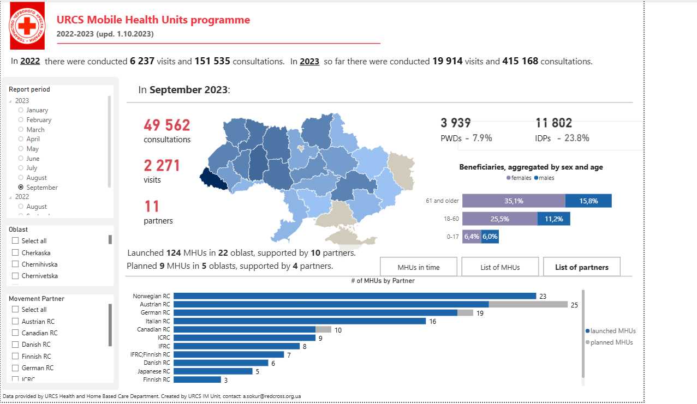
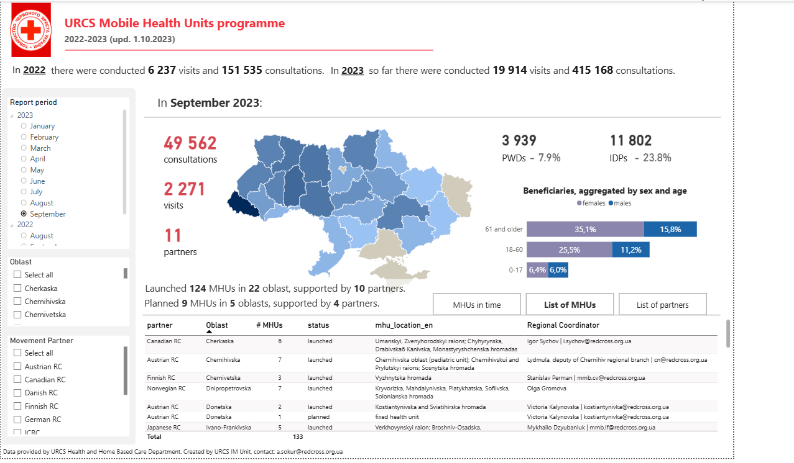
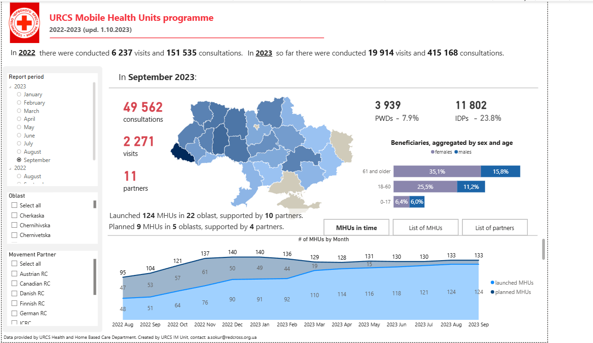

# Mobile Health Units Dashboard

## Overview

This Power BI dashboard was created for the Mobile Health Units programme across Ukraine.

The dashboard shows consultations, visits, launched and planned mobile health units, partner support, and beneficiary groups across all oblasts. It covers one full calendar year and gives management and donors a clear overall picture of programme activity.

I created this dashboard for internal management and donor reporting, so users could quickly understand how the programme was developing, where services were delivered, and how donor support influenced the overall situation.

## Purpose

The main purpose of this dashboard was to bring programme data into one place and make it easier to review.

Instead of checking separate files or manual reports, management and donors can use the dashboard to see the number of consultations and visits, compare oblasts, review partner involvement, and understand how the programme changed over time.

## Data sources and tools

- Power BI
- DAX
- Data cleaning and transformation
- Programme reporting data
- Partner and oblast-level data
- Dashboard design for management reporting

## What the dashboard shows

- Total consultations and visits by reporting period
- Old and new visits across the selected calendar year
- Mobile Health Unit activity across all oblasts
- Launched and planned Mobile Health Units
- Number of partners supporting the programme
- Donor and partner contribution by oblast
- Beneficiary groups, including IDPs and people with disabilities
- Beneficiary breakdown by age and gender
- Monthly change in the number of Mobile Health Units
- Lists of Mobile Health Units and partners for more detailed review

## Main observations

- The dashboard gives a full country-level view of Mobile Health Unit activity.
- Management can quickly compare regions and see where activity is higher or lower.
- Donors can see how their support contributes to programme coverage.
- The map helps show the geographic spread of services across Ukraine.
- The monthly view makes it easier to follow how the programme expanded during the year.
- The beneficiary section helps show who was reached, including IDPs and people with disabilities.

## Dashboard preview

### Overview and partner contribution

### List of Mobile Health Units

### Mobile Health Units over time

## Data note

The source data is not included because it contains operational and programme information. For this portfolio, I included dashboard screenshots to show the structure, visuals, and type of analysis.

